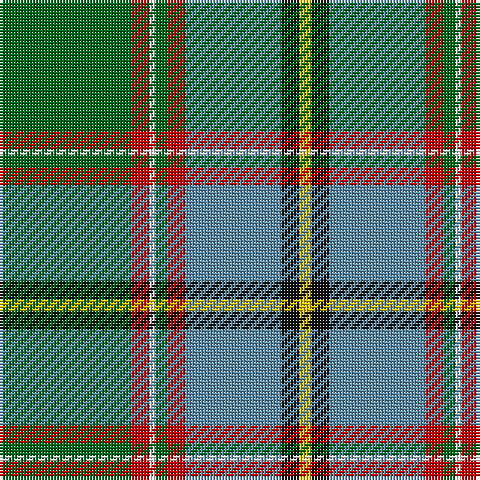

The parent of this is [Stirling University (Corporate)](/tartans/g/44/r6/w2/g4/r6/b32/k6/y/4/)

This was sourced from tartans-authority.  It is a [8 stripes tartan](/stripes/stripes8/).

Original link http://www.tartansauthority.com/tartan-ferret/display/2297/

## Thread count
G/44 R6 W2 G4 R6 B32 K6 Y/4

## Palette
Each colour and its ΔE from the base-6 reference it is a variant of.

| Colour | Shade | Base | ΔE (OKLab) |
|---|---|---|---|
| B |  `#5C8CA8` | B  | 0.23 |
| G |  `#006818` | G  | 0.02 |
| K |  `#101010` | K  | 0.17 |
| R |  `#C80000` | R  | 0.00 |
| W |  `#FCFCFC` | W  | 0.03 |
| Y |  `#E8C000` | Y  | 0.00 |

# Sample pattern

ID: /variants/g/44/r6/w2/g4/r6/b32/k6/y/4-b5c8ca8-g006818-k101010-rc80000-wfcfcfc-ye8c000/
