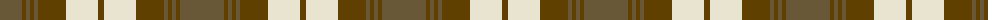

The parent of this is [Snaefell (District)](/tartans/g/44/t4/g4/t4/g4/t28/w32/t/6/)

This was sourced from tartans-authority.  It is a [8 stripes tartan](/stripes/stripes8/).

Original link http://www.tartansauthority.com/tartan-ferret/display/5319/

## Thread count
G/44 T4 G4 T4 G4 T28 W32 T/6

## Palette
Each colour and its ΔE from the base-6 reference it is a variant of.

| Colour | Shade | Base | ΔE (OKLab) |
|---|---|---|---|
| G |  `#685838` | G  | 0.13 |
| T |  `#604000` | G  | 0.14 |
| W |  `#E8E4D0` | W  | 0.05 |

# Sample pattern

ID: /variants/g/44/t4/g4/t4/g4/t28/w32/t/6-g685838-t604000-we8e4d0/
