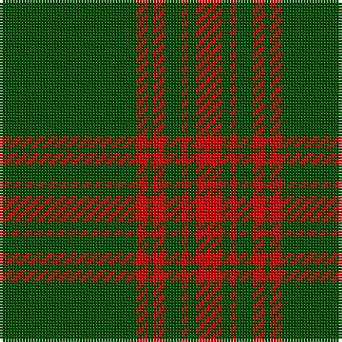

The parent of this is [Menzies Hunting](/tartans/g/48/r4/g2/r4/g6/r2/g3/r/9/)

This was sourced from weddslist.  It is a [8 stripes tartan](/stripes/stripes8/).

Original link http://www.weddslist.com/cgi-bin/tartans/pg.pl?source=rb

## Thread count
G/48 R4 G2 R4 G6 R2 G3 R/9

## Palette
Each colour and its ΔE from the base-6 reference it is a variant of.

| Colour | Shade | Base | ΔE (OKLab) |
|---|---|---|---|
| G |  `#004C00` | G  | 0.08 |
| R |  `#C80000` | R  | 0.00 |

# Sample pattern

ID: /variants/g/48/r4/g2/r4/g6/r2/g3/r/9-g004c00-rc80000/
