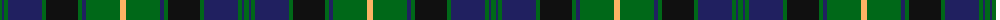

The parent of this is [Sardar Chadha (Personal)](/tartans/g/5/db2/g4/db34/g4/k32/g4/db4/g34/lg/6/)

This was sourced from tartans-authority.  It is a [10 stripes tartan](/stripes/stripes10/).

Original link http://www.tartansauthority.com/tartan-ferret/display/8455/

## Thread count
G/5 DB2 G4 DB34 G4 K32 G4 DB4 G34 LG/6

## Palette
Each colour and its ΔE from the base-6 reference it is a variant of.

| Colour | Shade | Base | ΔE (OKLab) |
|---|---|---|---|
| DB |  `#202060` | B  | 0.11 |
| G |  `#006818` | G  | 0.02 |
| K |  `#101010` | K  | 0.17 |
| LG |  `#FCB464` | Y  | 0.08 |

ID: /variants/g/5/db2/g4/db34/g4/k32/g4/db4/g34/lg/6-db202060-g006818-k101010-lgfcb464/
