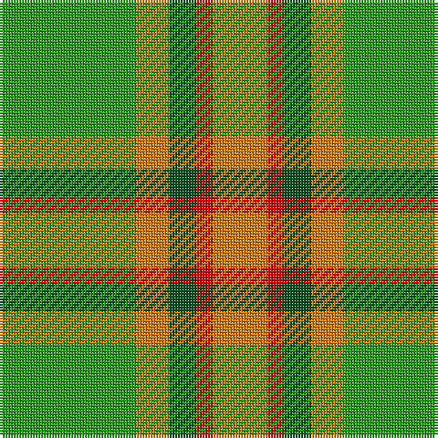

The parent of this is [Pendlebury, Andrew (Personal)](/tartans/g/50/o12/ga10/r6/o/20/)

This was sourced from register-of-tartans.  It is a [5 stripes tartan](/stripes/stripes5/).

Original link https://www.tartanregister.gov.uk/tartanDetails.aspx?ref=11462

## Thread count
G/50 O12 Ga10 R6 O/20

## Palette
Each colour and its ΔE from the base-6 reference it is a variant of.

| Colour | Shade | Base | ΔE (OKLab) |
|---|---|---|---|
| G |  `#289C18` | G  | 0.18 |
| Ga |  `#005020` | G  | 0.08 |
| O |  `#D87C00` | Y  | 0.17 |
| R |  `#DC0000` | R  | 0.04 |

# Sample pattern

ID: /variants/g/50/o12/ga10/r6/o/20-g289c18-ga005020-od87c00-rdc0000/
