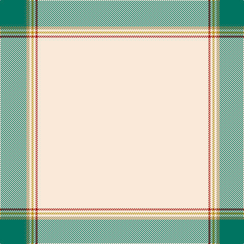

The parent of this is [Whisky Kilt (Fashion)](/tartans/g/52/lt6/ly4/dy4/ly4/dra4/ly/336/)

This was sourced from tartans-authority.  It is a [7 stripes tartan](/stripes/stripes7/).

Original link http://www.tartansauthority.com/tartan-ferret/display/8264/

## Thread count
G/52 LT6 LY4 DY4 LY4 DRa4 LY/336

## Palette
Each colour and its ΔE from the base-6 reference it is a variant of.

| Colour | Shade | Base | ΔE (OKLab) |
|---|---|---|---|
| DR |  `#441800` | B  | 0.22 |
| DRa |  `#A00000` | R  | 0.09 |
| DY |  `#BC8C00` | Y  | 0.16 |
| G |  `#007460` | G  | 0.11 |
| K |  `#000000` | K  | 0.00 |
| LT |  `#A08858` | Y  | 0.21 |
| LY |  `#F8E8D8` | W  | 0.04 |

# Sample pattern

ID: /variants/g/52/lt6/ly4/dy4/ly4/dra4/ly/336-dr441800-draa00000-dybc8c00-g007460-k000000-lta08858-lyf8e8d8/
