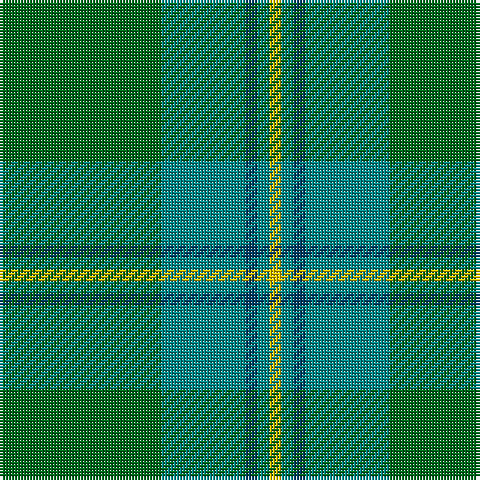

The parent of this is [Irving of Bonshaw Clan/Family Tartan Tartan Number: 2609. Earliest known date: c. 1992 Designed by the Scottish Tartans Society for Captain R.A.S. Irving RN (Retd) and Mr R.C. Irving, for all those of the original Border Clan Irving of Bonshaw and for all Border Irvings, Irvines and variant spellings of the name. The purpose is to distinguish from other persons bearing the name who may wish to wear the Clan Irvine. The tartan is a variation on the historic Irvine tartan. Its purpose is to include all persons related to Clan Irving of Bonshaw. See products available Copyright © Blair Urquhart, Comrie, 2015](/tartans/g/54/b28/db4/b4/y/4/)

This was sourced from house-of-tartan.  It is a [5 stripes tartan](/stripes/stripes5/).

Original link http://www.house-of-tartan.scotland.net/house/TartanViewjs.asp?colr=Def&tnam=2609

## Thread count
G/54 B28 DB4 B4 Y/4

## Palette
Each colour and its ΔE from the base-6 reference it is a variant of.

| Colour | Shade | Base | ΔE (OKLab) |
|---|---|---|---|
| B |  `#048888` | G  | 0.18 |
| DB |  `#003C64` | B  | 0.07 |
| G |  `#006818` | G  | 0.02 |
| Y |  `#E8C000` | Y  | 0.00 |

# Sample pattern

ID: /variants/g/54/b28/db4/b4/y/4-b048888-db003c64-g006818-ye8c000/
