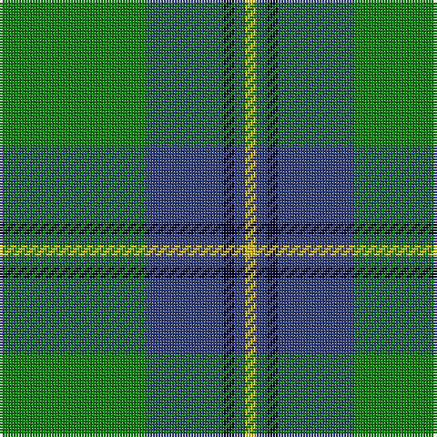

The parent of this is [Irving of Bonshaw](/tartans/g/54/b28/db4/b4/y/4/)

This was sourced from weddslist.  It is a [5 stripes tartan](/stripes/stripes5/).

Original link http://www.weddslist.com/cgi-bin/tartans/pg.pl?source=sts

## Thread count
G/54 B28 DB4 B4 Y/4

## Palette
Each colour and its ΔE from the base-6 reference it is a variant of.

| Colour | Shade | Base | ΔE (OKLab) |
|---|---|---|---|
| B |  `#304080` | B  | 0.01 |
| DB |  `#000030` | K  | 0.17 |
| G |  `#008000` | G  | 0.09 |
| Y |  `#F0C000` | Y  | 0.01 |

# Sample pattern

ID: /variants/g/54/b28/db4/b4/y/4-b304080-db000030-g008000-yf0c000/
