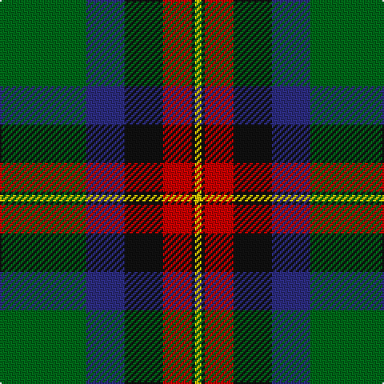

The parent of this is [Ferguson, Jerrfey S (Personal)](/tartans/g/54/db24/k24/r18/k2/y/4/)

This was sourced from tartans-authority.  It is a [6 stripes tartan](/stripes/stripes6/).

Original link http://www.tartansauthority.com/tartan-ferret/display/11199/

## Thread count
G/54 DB24 K24 R18 K2 Y/4

## Palette
Each colour and its ΔE from the base-6 reference it is a variant of.

| Colour | Shade | Base | ΔE (OKLab) |
|---|---|---|---|
| DB |  `#2C2C80` | B  | 0.05 |
| G |  `#006818` | G  | 0.02 |
| K |  `#101010` | K  | 0.17 |
| R |  `#C80000` | R  | 0.00 |
| Y |  `#FCCC00` | Y  | 0.04 |

# Sample pattern

ID: /variants/g/54/db24/k24/r18/k2/y/4-db2c2c80-g006818-k101010-rc80000-yfccc00/
