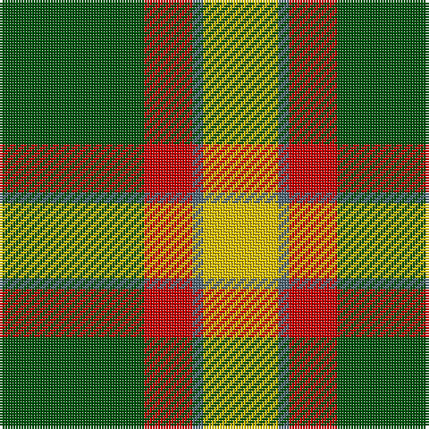

The parent of this is [City of Englehart (District)](/tartans/g/54/r18/n4/y/28/)

This was sourced from tartans-authority.  It is a [4 stripes tartan](/stripes/stripes4/).

Original link http://www.tartansauthority.com/tartan-ferret/display/849/

## Thread count
G/54 R18 N4 Y/28

## Palette
Each colour and its ΔE from the base-6 reference it is a variant of.

| Colour | Shade | Base | ΔE (OKLab) |
|---|---|---|---|
| G |  `#00540C` | G  | 0.05 |
| N |  `#506878` | B  | 0.14 |
| R |  `#C80000` | R  | 0.00 |
| Y |  `#E8C000` | Y  | 0.00 |

# Sample pattern

ID: /variants/g/54/r18/n4/y/28-g00540c-n506878-rc80000-ye8c000/
