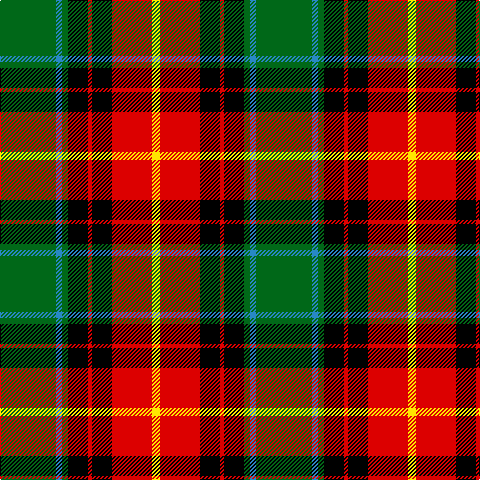

The parent of this is [Garvock (2015)](/tartans/g/56/b6/g6/k20/r4/k20/r40/y/8/)

This was sourced from register-of-tartans.  It is a [8 stripes tartan](/stripes/stripes8/).

Original link https://www.tartanregister.gov.uk/tartanDetails.aspx?ref=11389

## Thread count
G/56 B6 G6 K20 R4 K20 R40 Y/8

## Palette
Each colour and its ΔE from the base-6 reference it is a variant of.

| Colour | Shade | Base | ΔE (OKLab) |
|---|---|---|---|
| B |  `#2888C4` | B  | 0.21 |
| G |  `#006818` | G  | 0.02 |
| K |  `#000000` | K  | 0.00 |
| R |  `#DC0000` | R  | 0.04 |
| Y |  `#FFE600` | Y  | 0.10 |

# Sample pattern

ID: /variants/g/56/b6/g6/k20/r4/k20/r40/y/8-b2888c4-g006818-k000000-rdc0000-yffe600/
