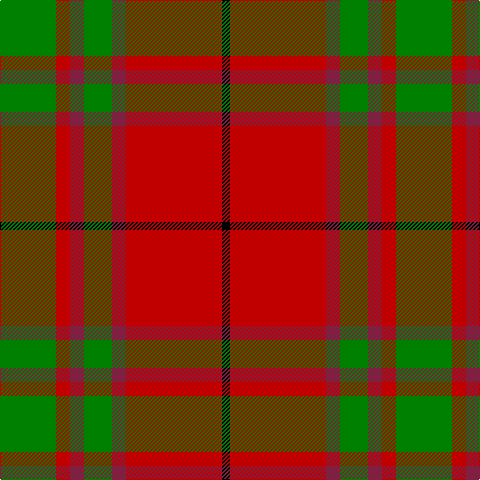

The parent of this is [MacNab 6](/tartans/g/56/r14/dr14/g28/dr14/r96/k/8/)

This was sourced from weddslist.  It is a [7 stripes tartan](/stripes/stripes7/).

Original link http://www.weddslist.com/cgi-bin/tartans/pg.pl?source=sts

## Thread count
G/56 R14 DR14 G28 DR14 R96 K/8

## Palette
Each colour and its ΔE from the base-6 reference it is a variant of.

| Colour | Shade | Base | ΔE (OKLab) |
|---|---|---|---|
| DR |  `#802040` | R  | 0.16 |
| G |  `#008000` | G  | 0.09 |
| K |  `#000000` | K  | 0.00 |
| R |  `#C00000` | R  | 0.02 |

# Sample pattern

ID: /variants/g/56/r14/dr14/g28/dr14/r96/k/8-dr802040-g008000-k000000-rc00000/
