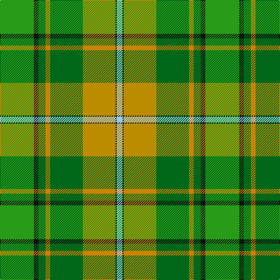

The parent of this is [Keogh (Name?)](/tartans/g/58/k8/ga12/o8/ga56/dy56/k2/lb/10/)

This was sourced from tartans-authority.  It is a [8 stripes tartan](/stripes/stripes8/).

Original link http://www.tartansauthority.com/tartan-ferret/display/4050/

## Thread count
G/58 K8 Ga12 O8 Ga56 DY56 K2 LB/10

## Palette
Each colour and its ΔE from the base-6 reference it is a variant of.

| Colour | Shade | Base | ΔE (OKLab) |
|---|---|---|---|
| DY |  `#BC8C00` | Y  | 0.16 |
| G |  `#289C18` | G  | 0.18 |
| Ga |  `#006818` | G  | 0.02 |
| K |  `#101010` | K  | 0.17 |
| LB |  `#98C8E8` | W  | 0.17 |
| O |  `#D87C00` | Y  | 0.17 |

# Sample pattern

ID: /variants/g/58/k8/ga12/o8/ga56/dy56/k2/lb/10-dybc8c00-g289c18-ga006818-k101010-lb98c8e8-od87c00/
