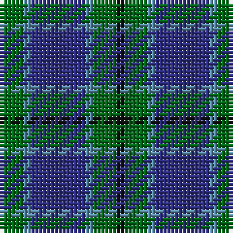

The parent of this is [Scott Green (Sir Walter)](/tartans/g/6/b2/dba14/b2/g6/k/2/)

This was sourced from register-of-tartans.  It is a [6 stripes tartan](/stripes/stripes6/).

Original link https://www.tartanregister.gov.uk/tartanDetails.aspx?ref=3699

## Thread count
G/6 B2 DBa14 B2 G6 K/2

## Palette
Each colour and its ΔE from the base-6 reference it is a variant of.

| Colour | Shade | Base | ΔE (OKLab) |
|---|---|---|---|
| B |  `#5C8CA8` | B  | 0.23 |
| DB |  `#202060` | B  | 0.11 |
| DBa |  `#2C2C80` | B  | 0.05 |
| DG |  `#003820` | G  | 0.16 |
| G |  `#006818` | G  | 0.02 |
| K |  `#101010` | K  | 0.17 |
| LG |  `#789484` | G  | 0.23 |

# Sample pattern

ID: /variants/g/6/b2/dba14/b2/g6/k/2-b5c8ca8-db202060-dba2c2c80-dg003820-g006818-k101010-lg789484/
