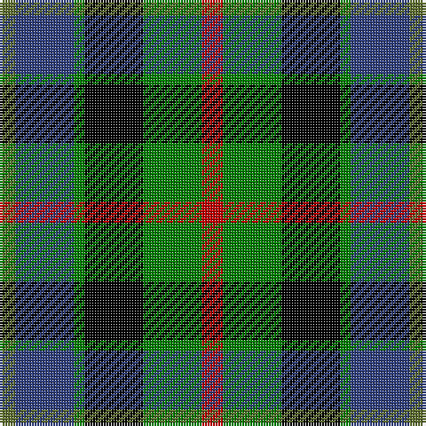

The parent of this is [Casely](/tartans/g/6/b22/ga4/k22/ga22/r/8/)

This was sourced from weddslist.  It is a [6 stripes tartan](/stripes/stripes6/).

Original link http://www.weddslist.com/cgi-bin/tartans/pg.pl?source=sts

## Thread count
G/6 B22 Ga4 K22 Ga22 R/8

## Palette
Each colour and its ΔE from the base-6 reference it is a variant of.

| Colour | Shade | Base | ΔE (OKLab) |
|---|---|---|---|
| B |  `#304080` | B  | 0.01 |
| G |  `#607030` | G  | 0.11 |
| Ga |  `#008000` | G  | 0.09 |
| K |  `#000000` | K  | 0.00 |
| R |  `#C00000` | R  | 0.02 |

# Sample pattern

ID: /variants/g/6/b22/ga4/k22/ga22/r/8-b304080-g607030-ga008000-k000000-rc00000/
