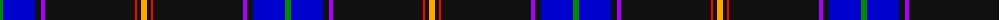

The parent of this is [Cumnock](/tartans/g/6/b32/k6/p4/k90/r2/k4/y/6/)

This was sourced from register-of-tartans.  It is a [8 stripes tartan](/stripes/stripes8/).

Original link https://www.tartanregister.gov.uk/tartanDetails.aspx?ref=10436

## Thread count
G/6 B32 K6 P4 K90 R2 K4 Y/6

## Palette
Each colour and its ΔE from the base-6 reference it is a variant of.

| Colour | Shade | Base | ΔE (OKLab) |
|---|---|---|---|
| B |  `#0000CD` | B  | 0.15 |
| G |  `#008B00` | G  | 0.12 |
| K |  `#101010` | K  | 0.17 |
| P |  `#AA00FF` | B  | 0.29 |
| R |  `#FF0000` | R  | 0.11 |
| Y |  `#FFA500` | Y  | 0.07 |

# Sample pattern

ID: /variants/g/6/b32/k6/p4/k90/r2/k4/y/6-b0000cd-g008b00-k101010-paa00ff-rff0000-yffa500/
