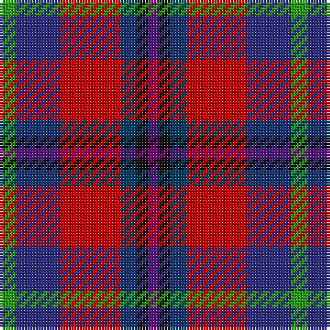

The parent of this is [Nicolson of Tiree & Coll (Clan)](/tartans/g/6/db16/r22/dba6/k4/p/4/)

This was sourced from tartans-authority.  It is a [6 stripes tartan](/stripes/stripes6/).

Original link http://www.tartansauthority.com/tartan-ferret/display/7870/

## Thread count
G/6 DB16 R22 DBa6 K4 P/4

## Palette
Each colour and its ΔE from the base-6 reference it is a variant of.

| Colour | Shade | Base | ΔE (OKLab) |
|---|---|---|---|
| DB |  `#2C2C80` | B  | 0.05 |
| DBa |  `#003C64` | B  | 0.07 |
| G |  `#289C18` | G  | 0.18 |
| K |  `#101010` | K  | 0.17 |
| P |  `#780078` | B  | 0.16 |
| R |  `#C80000` | R  | 0.00 |

# Sample pattern

ID: /variants/g/6/db16/r22/dba6/k4/p/4-db2c2c80-dba003c64-g289c18-k101010-p780078-rc80000/
