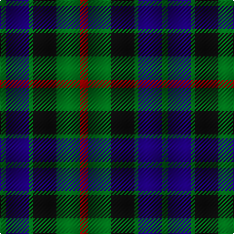

The parent of this is [Gunn - 1810 (Clan)](/tartans/g/6/db24/g4/k24/g24/r/8/)

This was sourced from tartans-authority.  It is a [6 stripes tartan](/stripes/stripes6/).

Original link http://www.tartansauthority.com/tartan-ferret/display/708/

## Thread count
G/6 DB24 G4 K24 G24 R/8

## Palette
Each colour and its ΔE from the base-6 reference it is a variant of.

| Colour | Shade | Base | ΔE (OKLab) |
|---|---|---|---|
| DB |  `#1C0070` | B  | 0.14 |
| G |  `#006818` | G  | 0.02 |
| K |  `#101010` | K  | 0.17 |
| R |  `#C80000` | R  | 0.00 |

# Sample pattern

ID: /variants/g/6/db24/g4/k24/g24/r/8-db1c0070-g006818-k101010-rc80000/
