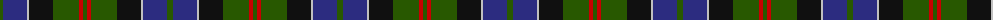

The parent of this is [MacPhedran/MacFadzean](/tartans/g/6/db24/n2/k24/g26/r4/g/4/)

This was sourced from tartans-authority.  It is a [7 stripes tartan](/stripes/stripes7/).

Original link http://www.tartansauthority.com/tartan-ferret/display/1102/

## Thread count
G/6 DB24 N2 K24 G26 R4 G/4

## Palette
Each colour and its ΔE from the base-6 reference it is a variant of.

| Colour | Shade | Base | ΔE (OKLab) |
|---|---|---|---|
| DB |  `#2C2C80` | B  | 0.05 |
| G |  `#285800` | G  | 0.04 |
| K |  `#101010` | K  | 0.17 |
| N |  `#C0C0C0` | W  | 0.16 |
| R |  `#C80000` | R  | 0.00 |

# Sample pattern

ID: /variants/g/6/db24/n2/k24/g26/r4/g/4-db2c2c80-g285800-k101010-nc0c0c0-rc80000/
