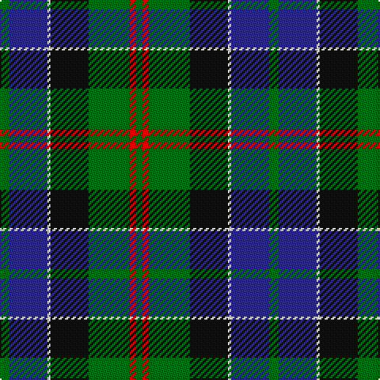

The parent of this is [Paterson (Personal)](/tartans/g/6/db24/w2/k24/g26/r4/g/4/)

This was sourced from tartans-authority.  It is a [7 stripes tartan](/stripes/stripes7/).

Original link http://www.tartansauthority.com/tartan-ferret/display/4174/

## Thread count
G/6 DB24 W2 K24 G26 R4 G/4

## Palette
Each colour and its ΔE from the base-6 reference it is a variant of.

| Colour | Shade | Base | ΔE (OKLab) |
|---|---|---|---|
| DB |  `#2C2C80` | B  | 0.05 |
| G |  `#006818` | G  | 0.02 |
| K |  `#101010` | K  | 0.17 |
| R |  `#C80000` | R  | 0.00 |
| W |  `#FCFCFC` | W  | 0.03 |

# Sample pattern

ID: /variants/g/6/db24/w2/k24/g26/r4/g/4-db2c2c80-g006818-k101010-rc80000-wfcfcfc/
