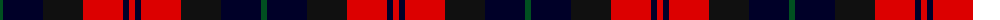
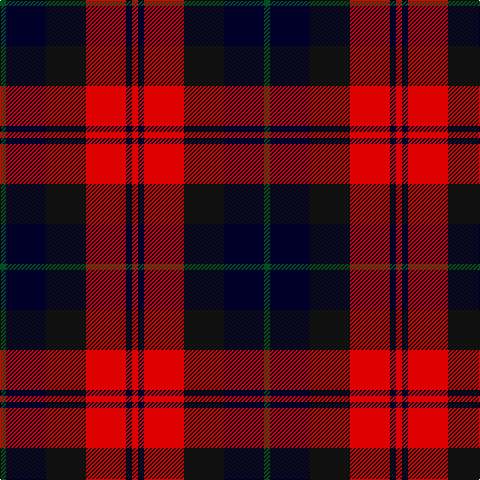

The parent of this is [Unidentified #65](/tartans/g/6/db40/k40/r40/db6/r/6/)

This was sourced from register-of-tartans.  It is a [6 stripes tartan](/stripes/stripes6/).

Original link https://www.tartanregister.gov.uk/tartanDetails.aspx?ref=5055

## Thread count
G/6 DB40 K40 R40 DB6 R/6

## Palette
Each colour and its ΔE from the base-6 reference it is a variant of.

| Colour | Shade | Base | ΔE (OKLab) |
|---|---|---|---|
| DB |  `#000028` | K  | 0.15 |
| G |  `#005020` | G  | 0.08 |
| K |  `#101010` | K  | 0.17 |
| R |  `#DC0000` | R  | 0.04 |

# Sample pattern

ID: /variants/g/6/db40/k40/r40/db6/r/6-db000028-g005020-k101010-rdc0000/
