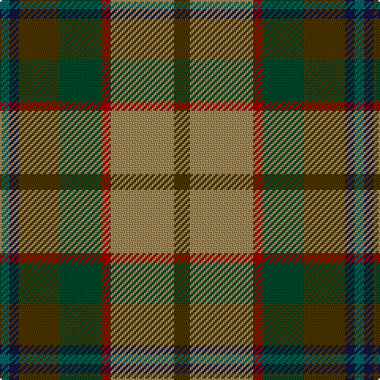

The parent of this is [Christmas Hill Game Farm (Corporate)](/tartans/g/6/db6/t26/dg26/dr6/lt40/t/10/)

This was sourced from tartans-authority.  It is a [7 stripes tartan](/stripes/stripes7/).

Original link http://www.tartansauthority.com/tartan-ferret/display/7821/

## Thread count
G/6 DB6 T26 DG26 DR6 LT40 T/10

## Palette
Each colour and its ΔE from the base-6 reference it is a variant of.

| Colour | Shade | Base | ΔE (OKLab) |
|---|---|---|---|
| DB |  `#141440` | B  | 0.18 |
| DG |  `#004828` | G  | 0.11 |
| DR |  `#A00000` | R  | 0.09 |
| G |  `#006464` | G  | 0.12 |
| LT |  `#A08858` | Y  | 0.21 |
| T |  `#4C3400` | G  | 0.16 |

# Sample pattern

ID: /variants/g/6/db6/t26/dg26/dr6/lt40/t/10-db141440-dg004828-dra00000-g006464-lta08858-t4c3400/
