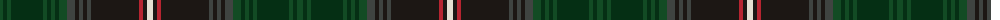

The parent of this is [Barkway Wedding 2012 Name Tartan Tartan Number: 10671. Earliest known date: Designed by Mr Barkway, using the Scotweb tartan designer, for his wedding in 2012, and as a family tartan. It may be used by anyone with the surname Barkway. Permission to use this tartan can be sought from the designer. See products available Copyright © Blair Urquhart, Comrie, 2015](/tartans/g/6/dg4/g4/dg32/g4/dg4/g4/dg4/g8/n8/k4/n4/k4/n4/k48/r4/k4/w/6/)

This was sourced from house-of-tartan.  It is a [18 stripes tartan](/stripes/stripes18/).

Original link http://www.house-of-tartan.scotland.net/house/TartanViewjs.asp?colr=Def&tnam=10671

## Thread count
G/6 DG4 G4 DG32 G4 DG4 G4 DG4 G8 N8 K4 N4 K4 N4 K48 R4 K4 W/6

## Palette
Each colour and its ΔE from the base-6 reference it is a variant of.

| Colour | Shade | Base | ΔE (OKLab) |
|---|---|---|---|
| DG |  `#052F14` | G  | 0.19 |
| G |  `#124B24` | G  | 0.09 |
| K |  `#1C1714` | K  | 0.21 |
| N |  `#3F4441` | B  | 0.12 |
| R |  `#B62531` | R  | 0.04 |
| W |  `#E5E0D2` | W  | 0.06 |

ID: /variants/g/6/dg4/g4/dg32/g4/dg4/g4/dg4/g8/n8/k4/n4/k4/n4/k48/r4/k4/w/6-dg052f14-g124b24-k1c1714-n3f4441-rb62531-we5e0d2/
