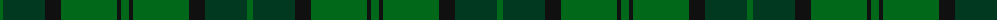

The parent of this is [Dunbar Htg (Clan)](/tartans/g/6/dg42/k16/g56/k4/g/8/)

This was sourced from tartans-authority.  It is a [6 stripes tartan](/stripes/stripes6/).

Original link http://www.tartansauthority.com/tartan-ferret/display/4744/

## Thread count
G/6 DG42 K16 G56 K4 G/8

## Palette
Each colour and its ΔE from the base-6 reference it is a variant of.

| Colour | Shade | Base | ΔE (OKLab) |
|---|---|---|---|
| DG |  `#003820` | G  | 0.16 |
| G |  `#006818` | G  | 0.02 |
| K |  `#101010` | K  | 0.17 |

# Sample pattern

ID: /variants/g/6/dg42/k16/g56/k4/g/8-dg003820-g006818-k101010/
