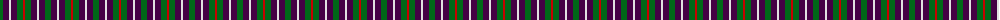
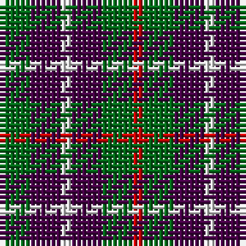

The parent of this is [Wilson's No.113](/tartans/g/6/dp6/ln2/dp6/g6/r/2/)

This was sourced from register-of-tartans.  It is a [6 stripes tartan](/stripes/stripes6/).

Original link https://www.tartanregister.gov.uk/tartanDetails.aspx?ref=4680

## Thread count
G/6 DP6 LN2 DP6 G6 R/2

## Palette
Each colour and its ΔE from the base-6 reference it is a variant of.

| Colour | Shade | Base | ΔE (OKLab) |
|---|---|---|---|
| DG |  `#003820` | G  | 0.16 |
| DP |  `#440044` | B  | 0.17 |
| G |  `#006818` | G  | 0.02 |
| LN |  `#E0E0E0` | W  | 0.06 |
| R |  `#C80000` | R  | 0.00 |

# Sample pattern

ID: /variants/g/6/dp6/ln2/dp6/g6/r/2-dg003820-dp440044-g006818-lne0e0e0-rc80000/
