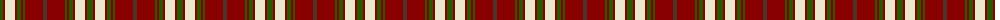

The parent of this is [Redwood Dress (Fashion)](/tartans/g/6/dr2/w10/dr2/g4/dr2/g2/dr18/t/4/)

This was sourced from tartans-authority.  It is a [9 stripes tartan](/stripes/stripes9/).

Original link http://www.tartansauthority.com/tartan-ferret/display/5423/

## Thread count
G/6 DR2 W10 DR2 G4 DR2 G2 DR18 T/4

## Palette
Each colour and its ΔE from the base-6 reference it is a variant of.

| Colour | Shade | Base | ΔE (OKLab) |
|---|---|---|---|
| DR |  `#880000` | R  | 0.14 |
| G |  `#285800` | G  | 0.04 |
| T |  `#4C3428` | B  | 0.16 |
| W |  `#ECE8CC` | W  | 0.05 |

ID: /variants/g/6/dr2/w10/dr2/g4/dr2/g2/dr18/t/4-dr880000-g285800-t4c3428-wece8cc/
