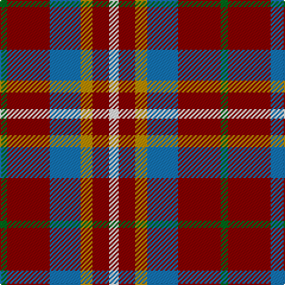

The parent of this is [Ryan/Fehder (Personal)](/tartans/g/6/dr36/b26/dy10/dr14/w/8/)

This was sourced from tartans-authority.  It is a [6 stripes tartan](/stripes/stripes6/).

Original link http://www.tartansauthority.com/tartan-ferret/display/10483/

## Thread count
G/6 DR36 B26 DY10 DR14 W/8

## Palette
Each colour and its ΔE from the base-6 reference it is a variant of.

| Colour | Shade | Base | ΔE (OKLab) |
|---|---|---|---|
| B |  `#1474B4` | B  | 0.15 |
| DR |  `#880000` | R  | 0.14 |
| DY |  `#BC8C00` | Y  | 0.16 |
| G |  `#006818` | G  | 0.02 |
| W |  `#FCFCFC` | W  | 0.03 |

# Sample pattern

ID: /variants/g/6/dr36/b26/dy10/dr14/w/8-b1474b4-dr880000-dybc8c00-g006818-wfcfcfc/
