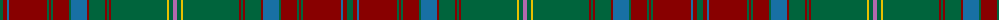

The parent of this is [Brewer (Name)](/tartans/g/6/dr4/b2/dr38/g2/dr2/g2/dr16/g2/b16/dr2/g16/dr2/g2/dr2/g56/y2/g4/p/4/)

This was sourced from tartans-authority.  It is a [19 stripes tartan](/stripes/stripes19/).

Original link http://www.tartansauthority.com/tartan-ferret/display/6833/

## Thread count
G/6 DR4 B2 DR38 G2 DR2 G2 DR16 G2 B16 DR2 G16 DR2 G2 DR2 G56 Y2 G4 P/4

## Palette
Each colour and its ΔE from the base-6 reference it is a variant of.

| Colour | Shade | Base | ΔE (OKLab) |
|---|---|---|---|
| B |  `#1870A4` | B  | 0.14 |
| DR |  `#880000` | R  | 0.14 |
| G |  `#00643C` | G  | 0.06 |
| P |  `#B468AC` | R  | 0.21 |
| Y |  `#E8C000` | Y  | 0.00 |

ID: /variants/g/6/dr4/b2/dr38/g2/dr2/g2/dr16/g2/b16/dr2/g16/dr2/g2/dr2/g56/y2/g4/p/4-b1870a4-dr880000-g00643c-pb468ac-ye8c000/
