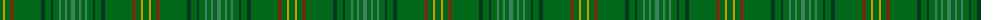

The parent of this is [New South Wales](/tartans/g/6/dy2/g6/r2/g28/dg4/g6/dg2/g6/ga2/g4/ga2/g4/ga/4/)

This was sourced from register-of-tartans.  It is a [14 stripes tartan](/stripes/stripes14/).

Original link https://www.tartanregister.gov.uk/tartanDetails.aspx?ref=3118

## Thread count
G/6 DY2 G6 R2 G28 DG4 G6 DG2 G6 Ga2 G4 Ga2 G4 Ga/4

## Palette
Each colour and its ΔE from the base-6 reference it is a variant of.

| Colour | Shade | Base | ΔE (OKLab) |
|---|---|---|---|
| DG |  `#003820` | G  | 0.16 |
| DY |  `#D09800` | Y  | 0.11 |
| G |  `#006818` | G  | 0.02 |
| Ga |  `#408060` | G  | 0.13 |
| R |  `#C80000` | R  | 0.00 |

ID: /variants/g/6/dy2/g6/r2/g28/dg4/g6/dg2/g6/ga2/g4/ga2/g4/ga/4-dg003820-dyd09800-g006818-ga408060-rc80000/
