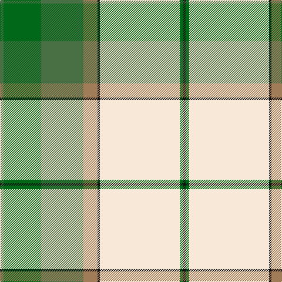

The parent of this is [Kintail Dress (Fashion)](/tartans/g/6/ga64/g72/lt24/k4/ly136/ga6/k/4/)

This was sourced from tartans-authority.  It is a [8 stripes tartan](/stripes/stripes8/).

Original link http://www.tartansauthority.com/tartan-ferret/display/5363/

## Thread count
G/6 Ga64 G72 LT24 K4 LY136 Ga6 K/4

## Palette
Each colour and its ΔE from the base-6 reference it is a variant of.

| Colour | Shade | Base | ΔE (OKLab) |
|---|---|---|---|
| G |  `#487044` | G  | 0.09 |
| Ga |  `#006818` | G  | 0.02 |
| K |  `#101010` | K  | 0.17 |
| LT |  `#A07C58` | R  | 0.19 |
| LY |  `#F8E8D8` | W  | 0.04 |

# Sample pattern

ID: /variants/g/6/ga64/g72/lt24/k4/ly136/ga6/k/4-g487044-ga006818-k101010-lta07c58-lyf8e8d8/
