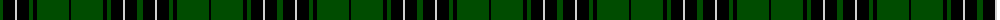
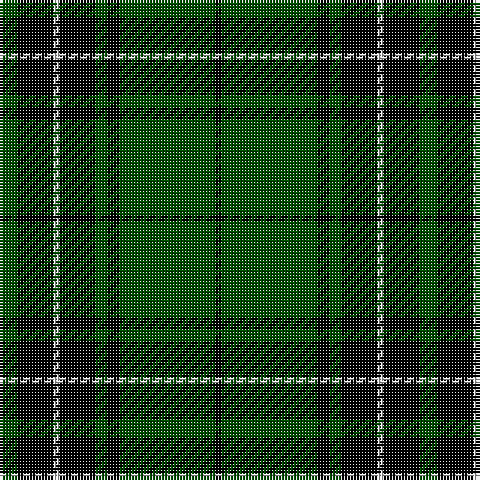

The parent of this is [MacLean VS](/tartans/g/6/k12/n2/k12/g4/k4/g32/k/2/)

This was sourced from weddslist.  It is a [8 stripes tartan](/stripes/stripes8/).

Original link http://www.weddslist.com/cgi-bin/tartans/pg.pl?source=rb

## Thread count
G/6 K12 N2 K12 G4 K4 G32 K/2

## Palette
Each colour and its ΔE from the base-6 reference it is a variant of.

| Colour | Shade | Base | ΔE (OKLab) |
|---|---|---|---|
| G |  `#004C00` | G  | 0.08 |
| K |  `#000000` | K  | 0.00 |
| N |  `#D0D0D0` | W  | 0.11 |

# Sample pattern

ID: /variants/g/6/k12/n2/k12/g4/k4/g32/k/2-g004c00-k000000-nd0d0d0/
