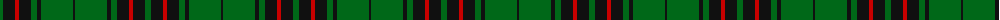
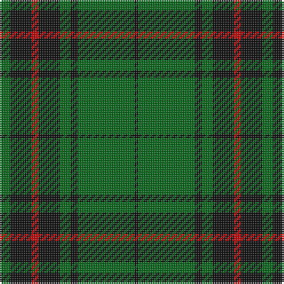

The parent of this is [Glenbarr (Corporate)](/tartans/g/6/k12/r4/k12/g6/k4/g32/k/2/)

This was sourced from tartans-authority.  It is a [8 stripes tartan](/stripes/stripes8/).

Original link http://www.tartansauthority.com/tartan-ferret/display/7366/

## Thread count
G/6 K12 R4 K12 G6 K4 G32 K/2

## Palette
Each colour and its ΔE from the base-6 reference it is a variant of.

| Colour | Shade | Base | ΔE (OKLab) |
|---|---|---|---|
| G |  `#006818` | G  | 0.02 |
| K |  `#101010` | K  | 0.17 |
| R |  `#C80000` | R  | 0.00 |

# Sample pattern

ID: /variants/g/6/k12/r4/k12/g6/k4/g32/k/2-g006818-k101010-rc80000/
