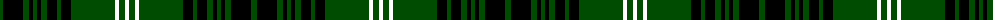

The parent of this is [Lochcarron Hunting (Corporate)](/tartans/g/6/k20/ga6/k4/ga4/k4/g6/k10/g4/k10/g44/r4/g6/r/4/)

This was sourced from tartans-authority.  It is a [14 stripes tartan](/stripes/stripes14/).

Original link http://www.tartansauthority.com/tartan-ferret/display/5464/

## Thread count
G/6 K20 Ga6 K4 Ga4 K4 G6 K10 G4 K10 G44 R4 G6 R/4

## Palette
Each colour and its ΔE from the base-6 reference it is a variant of.

| Colour | Shade | Base | ΔE (OKLab) |
|---|---|---|---|
| G |  `#004C00` | G  | 0.08 |
| Ga |  `#004C00` | G  | 0.08 |
| K |  `#000000` | K  | 0.00 |

ID: /variants/g/6/k20/ga6/k4/ga4/k4/g6/k10/g4/k10/g44/r4/g6/r/4-g004c00-ga004c00-k000000/
