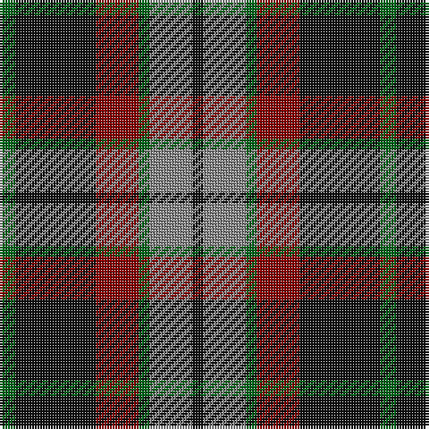

The parent of this is [Lindsay Hunting Clan/Family Tartan Tartan Number: 5429. Earliest known date: pre 2002 Sample in STA Johnston Collection. The history of this is not known and it may just be a fashion tartan from Pringles. The sett is the same as Thompson. See products available Copyright © Blair Urquhart, Comrie, 2015](/tartans/g/6/k30/dr16/g4/n16/k/4/)

This was sourced from house-of-tartan.  It is a [6 stripes tartan](/stripes/stripes6/).

Original link http://www.house-of-tartan.scotland.net/house/TartanViewjs.asp?colr=Def&tnam=5429

## Thread count
G/6 K30 DR16 G4 N16 K/4

## Palette
Each colour and its ΔE from the base-6 reference it is a variant of.

| Colour | Shade | Base | ΔE (OKLab) |
|---|---|---|---|
| DR |  `#880000` | R  | 0.14 |
| G |  `#006818` | G  | 0.02 |
| K |  `#101010` | K  | 0.17 |
| N |  `#888888` | R  | 0.24 |

# Sample pattern

ID: /variants/g/6/k30/dr16/g4/n16/k/4-dr880000-g006818-k101010-n888888/
