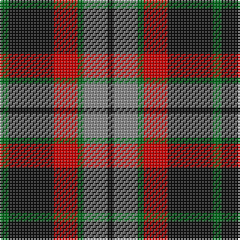

The parent of this is [Thompson Black (Fashion)](/tartans/g/6/k30/r16/g4/n16/k/4/)

This was sourced from tartans-authority.  It is a [6 stripes tartan](/stripes/stripes6/).

Original link http://www.tartansauthority.com/tartan-ferret/display/3596/

## Thread count
G/6 K30 R16 G4 N16 K/4

## Palette
Each colour and its ΔE from the base-6 reference it is a variant of.

| Colour | Shade | Base | ΔE (OKLab) |
|---|---|---|---|
| G |  `#006818` | G  | 0.02 |
| K |  `#101010` | K  | 0.17 |
| N |  `#888888` | R  | 0.24 |
| R |  `#C80000` | R  | 0.00 |

# Sample pattern

ID: /variants/g/6/k30/r16/g4/n16/k/4-g006818-k101010-n888888-rc80000/
