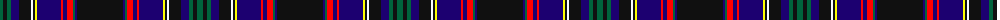

The parent of this is [Astrobiology](/tartans/g/6/k4/g4/db8/k12/w2/k2/y2/db24/r2/db4/r6/g2/db2/k/46/)

This was sourced from register-of-tartans.  It is a [15 stripes tartan](/stripes/stripes15/).

Original link https://www.tartanregister.gov.uk/tartanDetails.aspx?ref=11657

## Thread count
G/6 K4 G4 DB8 K12 W2 K2 Y2 DB24 R2 DB4 R6 G2 DB2 K/46

## Palette
Each colour and its ΔE from the base-6 reference it is a variant of.

| Colour | Shade | Base | ΔE (OKLab) |
|---|---|---|---|
| DB |  `#1C0070` | B  | 0.14 |
| G |  `#00643C` | G  | 0.06 |
| K |  `#101010` | K  | 0.17 |
| R |  `#FF0000` | R  | 0.11 |
| W |  `#FFFFFF` | W  | 0.03 |
| Y |  `#FFFF00` | Y  | 0.16 |

ID: /variants/g/6/k4/g4/db8/k12/w2/k2/y2/db24/r2/db4/r6/g2/db2/k/46-db1c0070-g00643c-k101010-rff0000-wffffff-yffff00/
