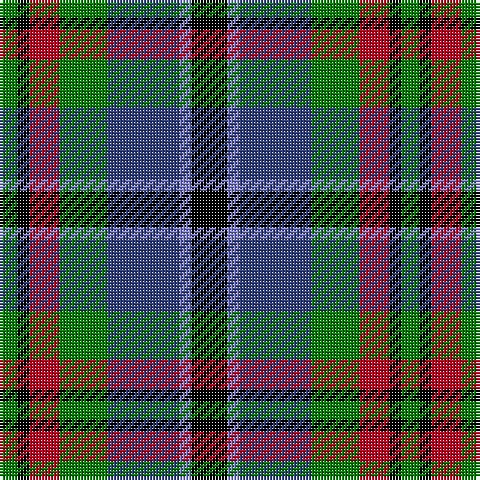

The parent of this is [Cooke](/tartans/g/6/k4/r10/g16/ba24/b4/k/12/)

This was sourced from weddslist.  It is a [7 stripes tartan](/stripes/stripes7/).

Original link http://www.weddslist.com/cgi-bin/tartans/pg.pl?source=sts

## Thread count
G/6 K4 R10 G16 Ba24 B4 K/12

## Palette
Each colour and its ΔE from the base-6 reference it is a variant of.

| Colour | Shade | Base | ΔE (OKLab) |
|---|---|---|---|
| B |  `#8080D0` | B  | 0.24 |
| Ba |  `#304080` | B  | 0.01 |
| G |  `#008000` | G  | 0.09 |
| K |  `#000000` | K  | 0.00 |
| R |  `#C00020` | R  | 0.02 |

# Sample pattern

ID: /variants/g/6/k4/r10/g16/ba24/b4/k/12-b8080d0-ba304080-g008000-k000000-rc00020/
