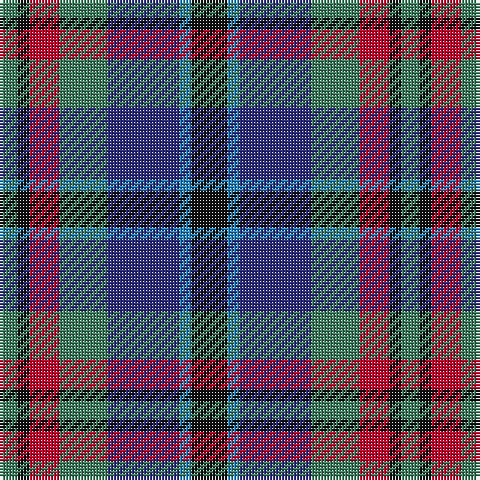

The parent of this is [Cooke Family Tartan Tartan Number: 2131. Earliest known date: 1993 Designed for Mr Bob Cooke and his family. Cookes were seafarers from the West Coast of Scotland and Ireland. Some including the designer, can trace forebears to Liverpool and the North West coast of England. The colours of the tartan reflect the seas, the skys and the heart of the sailor. See products available Copyright © Blair Urquhart, Comrie, 2015](/tartans/g/6/k4/r10/g16/db24/b4/k/12/)

This was sourced from house-of-tartan.  It is a [7 stripes tartan](/stripes/stripes7/).

Original link http://www.house-of-tartan.scotland.net/house/TartanViewjs.asp?colr=Def&tnam=2131

## Thread count
G/6 K4 R10 G16 DB24 B4 K/12

## Palette
Each colour and its ΔE from the base-6 reference it is a variant of.

| Colour | Shade | Base | ΔE (OKLab) |
|---|---|---|---|
| B |  `#2888C4` | B  | 0.21 |
| DB |  `#2C2C80` | B  | 0.05 |
| G |  `#408060` | G  | 0.13 |
| K |  `#101010` | K  | 0.17 |
| R |  `#C8002C` | R  | 0.03 |

# Sample pattern

ID: /variants/g/6/k4/r10/g16/db24/b4/k/12-b2888c4-db2c2c80-g408060-k101010-rc8002c/
