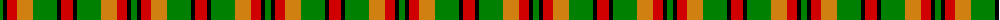
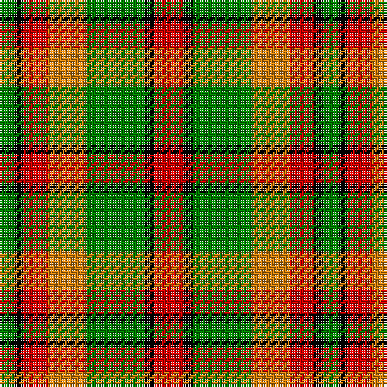

The parent of this is [Londonderry](/tartans/g/6/k4/r10/o16/g24/k4/r/12/)

This was sourced from weddslist.  It is a [7 stripes tartan](/stripes/stripes7/).

Original link http://www.weddslist.com/cgi-bin/tartans/pg.pl?source=sts

## Thread count
G/6 K4 R10 O16 G24 K4 R/12

## Palette
Each colour and its ΔE from the base-6 reference it is a variant of.

| Colour | Shade | Base | ΔE (OKLab) |
|---|---|---|---|
| G |  `#008000` | G  | 0.09 |
| K |  `#000000` | K  | 0.00 |
| O |  `#D08010` | Y  | 0.17 |
| R |  `#D00000` | R  | 0.02 |

# Sample pattern

ID: /variants/g/6/k4/r10/o16/g24/k4/r/12-g008000-k000000-od08010-rd00000/
