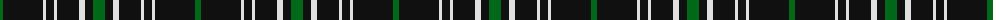

The parent of this is [Jensen, Sven (Personal)](/tartans/g/6/k40/ln3/k8/ln3/k22/ln6/k8/g/12/)

This was sourced from register-of-tartans.  It is a [9 stripes tartan](/stripes/stripes9/).

Original link https://www.tartanregister.gov.uk/tartanDetails.aspx?ref=11579

## Thread count
G/6 K40 LN3 K8 LN3 K22 LN6 K8 G/12

## Palette
Each colour and its ΔE from the base-6 reference it is a variant of.

| Colour | Shade | Base | ΔE (OKLab) |
|---|---|---|---|
| G |  `#006818` | G  | 0.02 |
| K |  `#101010` | K  | 0.17 |
| LN |  `#E0E0E0` | W  | 0.06 |

ID: /variants/g/6/k40/ln3/k8/ln3/k22/ln6/k8/g/12-g006818-k101010-lne0e0e0/
