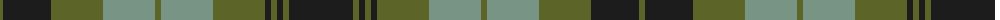

The parent of this is [MacIver Family (Personal)](/tartans/g/6/k48/g52/lg52/g6/lg52/g52/k6/g6/k6/g6/k/64/)

This was sourced from tartans-authority.  It is a [12 stripes tartan](/stripes/stripes12/).

Original link http://www.tartansauthority.com/tartan-ferret/display/6087/

## Thread count
G/6 K48 G52 LG52 G6 LG52 G52 K6 G6 K6 G6 K/64

## Palette
Each colour and its ΔE from the base-6 reference it is a variant of.

| Colour | Shade | Base | ΔE (OKLab) |
|---|---|---|---|
| G |  `#5C6428` | G  | 0.09 |
| K |  `#1C1C1C` | B  | 0.20 |
| LG |  `#789484` | G  | 0.23 |

ID: /variants/g/6/k48/g52/lg52/g6/lg52/g52/k6/g6/k6/g6/k/64-g5c6428-k1c1c1c-lg789484/
