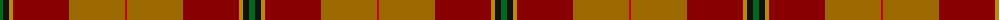
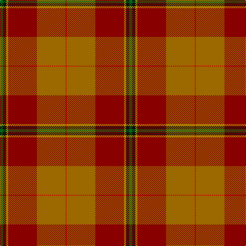

The parent of this is [Passchendaele (Commemorative)](/tartans/g/6/k6/dy4/dr56/do56/r/2/)

This was sourced from tartans-authority.  It is a [6 stripes tartan](/stripes/stripes6/).

Original link http://www.tartansauthority.com/tartan-ferret/display/6982/

## Thread count
G/6 K6 DY4 DR56 DO56 R/2

## Palette
Each colour and its ΔE from the base-6 reference it is a variant of.

| Colour | Shade | Base | ΔE (OKLab) |
|---|---|---|---|
| DO |  `#9C6800` | R  | 0.16 |
| DR |  `#880000` | R  | 0.14 |
| DY |  `#BC8C00` | Y  | 0.16 |
| G |  `#006818` | G  | 0.02 |
| K |  `#101010` | K  | 0.17 |
| R |  `#C80000` | R  | 0.00 |

# Sample pattern

ID: /variants/g/6/k6/dy4/dr56/do56/r/2-do9c6800-dr880000-dybc8c00-g006818-k101010-rc80000/
