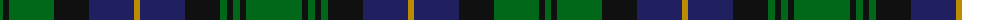

The parent of this is [Dewars Highlander (Corporate)](/tartans/g/6/k6/g45/k35/db45/dy6/db45/k35/g7/k6/g7/k6/g/56/)

This was sourced from tartans-authority.  It is a [13 stripes tartan](/stripes/stripes13/).

Original link http://www.tartansauthority.com/tartan-ferret/display/694/

## Thread count
G/6 K6 G45 K35 DB45 DY6 DB45 K35 G7 K6 G7 K6 G/56

## Palette
Each colour and its ΔE from the base-6 reference it is a variant of.

| Colour | Shade | Base | ΔE (OKLab) |
|---|---|---|---|
| DB |  `#202060` | B  | 0.11 |
| DY |  `#BC8C00` | Y  | 0.16 |
| G |  `#006818` | G  | 0.02 |
| K |  `#101010` | K  | 0.17 |

ID: /variants/g/6/k6/g45/k35/db45/dy6/db45/k35/g7/k6/g7/k6/g/56-db202060-dybc8c00-g006818-k101010/
