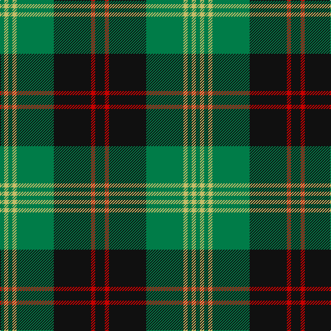

The parent of this is [Brunton (Personal)](/tartans/g/6/lg6/g6/lg6/g54/k54/r6/k/14/)

This was sourced from tartans-authority.  It is a [8 stripes tartan](/stripes/stripes8/).

Original link http://www.tartansauthority.com/tartan-ferret/display/6512/

## Thread count
G/6 LG6 G6 LG6 G54 K54 R6 K/14

## Palette
Each colour and its ΔE from the base-6 reference it is a variant of.

| Colour | Shade | Base | ΔE (OKLab) |
|---|---|---|---|
| G |  `#007C48` | G  | 0.09 |
| K |  `#101010` | K  | 0.17 |
| LG |  `#C4BC68` | Y  | 0.07 |
| R |  `#C80000` | R  | 0.00 |

# Sample pattern

ID: /variants/g/6/lg6/g6/lg6/g54/k54/r6/k/14-g007c48-k101010-lgc4bc68-rc80000/
