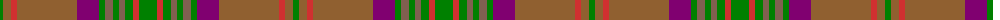

The parent of this is [Harmony 5](/tartans/g/6/lt8/r6/lt60/p22/g6/lta8/g6/lta6/g8/r6/g/18/)

This was sourced from weddslist.  It is a [12 stripes tartan](/stripes/stripes12/).

Original link http://www.weddslist.com/cgi-bin/tartans/pg.pl?source=sts

## Thread count
G/6 LT8 R6 LT60 P22 G6 LTa8 G6 LTa6 G8 R6 G/18

## Palette
Each colour and its ΔE from the base-6 reference it is a variant of.

| Colour | Shade | Base | ΔE (OKLab) |
|---|---|---|---|
| G |  `#008000` | G  | 0.09 |
| LT |  `#906030` | R  | 0.15 |
| LTa |  `#806050` | R  | 0.17 |
| P |  `#800070` | B  | 0.17 |
| R |  `#D03030` | R  | 0.05 |

ID: /variants/g/6/lt8/r6/lt60/p22/g6/lta8/g6/lta6/g8/r6/g/18-g008000-lt906030-lta806050-p800070-rd03030/
