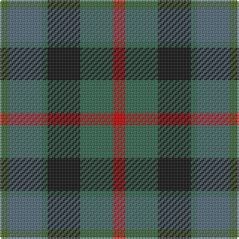

The parent of this is [Casely](/tartans/g/6/n22/ga4/k22/ga22/r/8/)

This was sourced from register-of-tartans.  It is a [6 stripes tartan](/stripes/stripes6/).

Original link https://www.tartanregister.gov.uk/tartanDetails.aspx?ref=586

## Thread count
G/6 N22 Ga4 K22 Ga22 R/8

## Palette
Each colour and its ΔE from the base-6 reference it is a variant of.

| Colour | Shade | Base | ΔE (OKLab) |
|---|---|---|---|
| G |  `#446428` | G  | 0.06 |
| Ga |  `#30644C` | G  | 0.09 |
| K |  `#101010` | K  | 0.17 |
| N |  `#506878` | B  | 0.14 |
| R |  `#C80000` | R  | 0.00 |

# Sample pattern

ID: /variants/g/6/n22/ga4/k22/ga22/r/8-g446428-ga30644c-k101010-n506878-rc80000/
