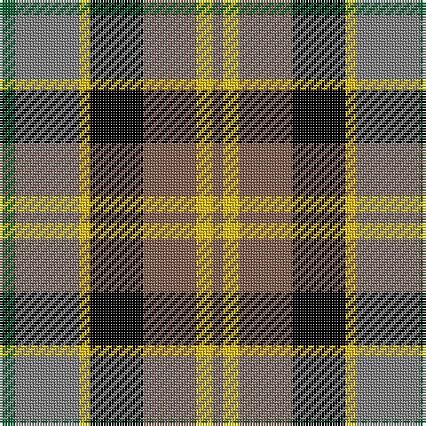

The parent of this is [Rothesay](/tartans/g/6/n24/y4/k20/lt20/y6/lt/4/)

This was sourced from weddslist.  It is a [7 stripes tartan](/stripes/stripes7/).

Original link http://www.weddslist.com/cgi-bin/tartans/pg.pl?source=sts

## Thread count
G/6 N24 Y4 K20 LT20 Y6 LT/4

## Palette
Each colour and its ΔE from the base-6 reference it is a variant of.

| Colour | Shade | Base | ΔE (OKLab) |
|---|---|---|---|
| G |  `#006030` | G  | 0.04 |
| K |  `#000000` | K  | 0.00 |
| LT |  `#806050` | R  | 0.17 |
| N |  `#808080` | G  | 0.22 |
| Y |  `#F0C000` | Y  | 0.01 |

# Sample pattern

ID: /variants/g/6/n24/y4/k20/lt20/y6/lt/4-g006030-k000000-lt806050-n808080-yf0c000/
