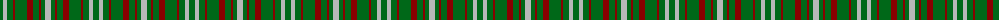

The parent of this is [Dundee, Green (Fashion)](/tartans/g/6/n4/g6/dr2/g12/dr6/g6/dr2/g4/n/6/)

This was sourced from tartans-authority.  It is a [10 stripes tartan](/stripes/stripes10/).

Original link http://www.tartansauthority.com/tartan-ferret/display/2065/

## Thread count
G/6 N4 G6 DR2 G12 DR6 G6 DR2 G4 N/6

## Palette
Each colour and its ΔE from the base-6 reference it is a variant of.

| Colour | Shade | Base | ΔE (OKLab) |
|---|---|---|---|
| DR |  `#880000` | R  | 0.14 |
| G |  `#006818` | G  | 0.02 |
| N |  `#B8B8B8` | Y  | 0.17 |

ID: /variants/g/6/n4/g6/dr2/g12/dr6/g6/dr2/g4/n/6-dr880000-g006818-nb8b8b8/
