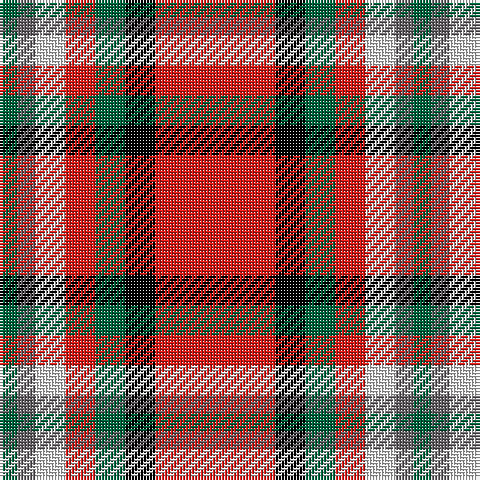

The parent of this is [Mangles, Peter and Annette (Personal)](/tartans/g/6/n6/ln10/r10/g10/k10/r/40/)

This was sourced from register-of-tartans.  It is a [7 stripes tartan](/stripes/stripes7/).

Original link https://www.tartanregister.gov.uk/tartanDetails.aspx?ref=10844

## Thread count
G/6 N6 LN10 R10 G10 K10 R/40

## Palette
Each colour and its ΔE from the base-6 reference it is a variant of.

| Colour | Shade | Base | ΔE (OKLab) |
|---|---|---|---|
| G |  `#00643C` | G  | 0.06 |
| K |  `#000000` | K  | 0.00 |
| LN |  `#E8E8E8` | W  | 0.04 |
| N |  `#686468` | B  | 0.16 |
| R |  `#E01C18` | R  | 0.06 |

# Sample pattern

ID: /variants/g/6/n6/ln10/r10/g10/k10/r/40-g00643c-k000000-lne8e8e8-n686468-re01c18/
