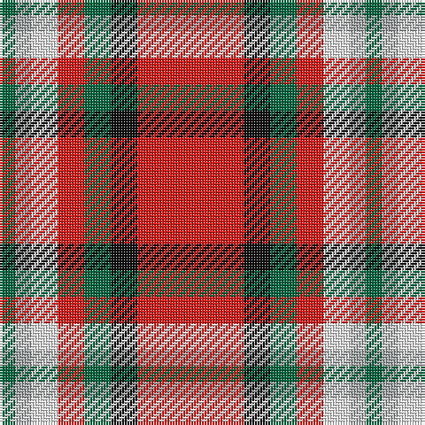

The parent of this is [Mangles, Peter and Annette Family/Personal Tartan Tartan Number: 10844. Earliest known date: 02/05/2013 The colours were chosen to represent the organisation and the location where Peter and Annette first met in Liverpool. In addition the red is representative of the city of Aberdeen (Scotland) and the black and grey is representative of the granite used extensively throughout Aberdeen See products available Copyright © Blair Urquhart, Comrie, 2015](/tartans/g/6/n6/w10/r10/g10/k10/r/40/)

This was sourced from house-of-tartan.  It is a [7 stripes tartan](/stripes/stripes7/).

Original link http://www.house-of-tartan.scotland.net/house/TartanViewjs.asp?colr=Def&tnam=10844

## Thread count
G/6 N6 W10 R10 G10 K10 R/40

## Palette
Each colour and its ΔE from the base-6 reference it is a variant of.

| Colour | Shade | Base | ΔE (OKLab) |
|---|---|---|---|
| G |  `#006840` | G  | 0.06 |
| K |  `#101010` | K  | 0.17 |
| N |  `#A4A8A8` | Y  | 0.19 |
| R |  `#E01C18` | R  | 0.06 |
| W |  `#F8F8F8` | W  | 0.01 |

# Sample pattern

ID: /variants/g/6/n6/w10/r10/g10/k10/r/40-g006840-k101010-na4a8a8-re01c18-wf8f8f8/
